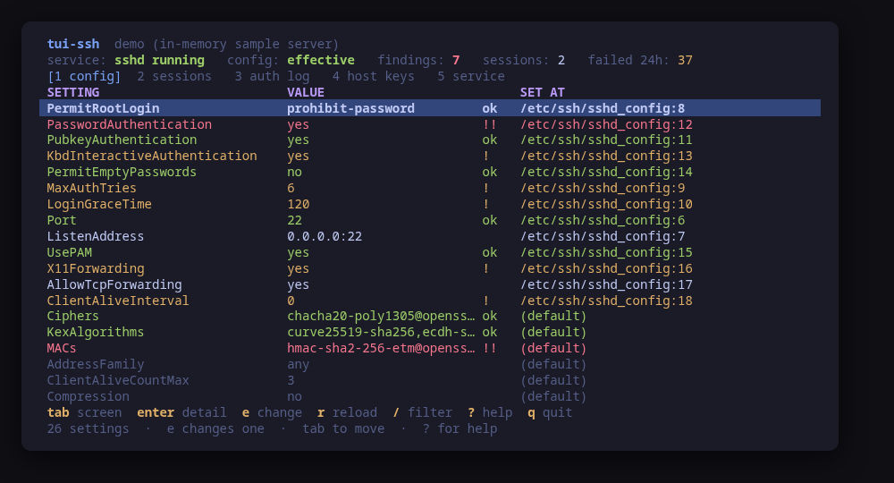
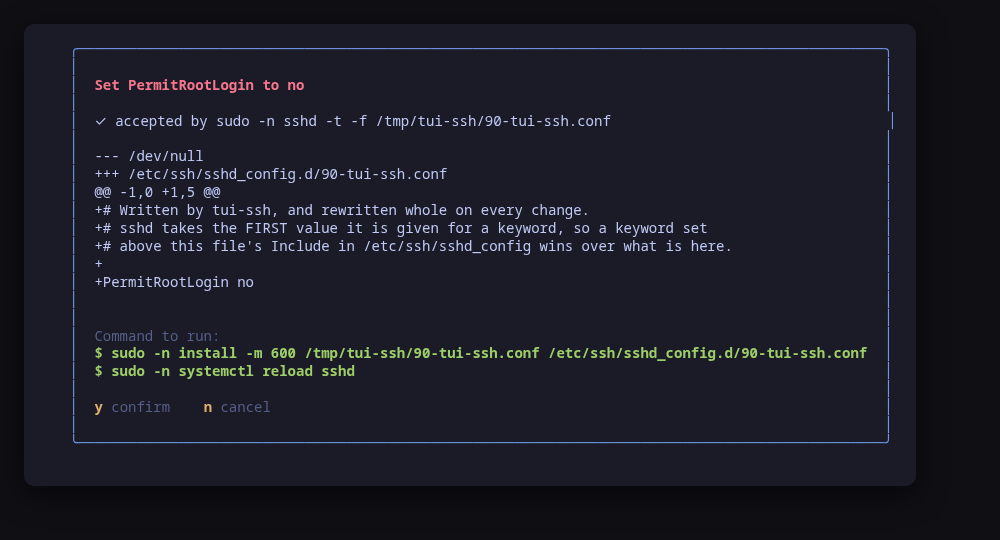
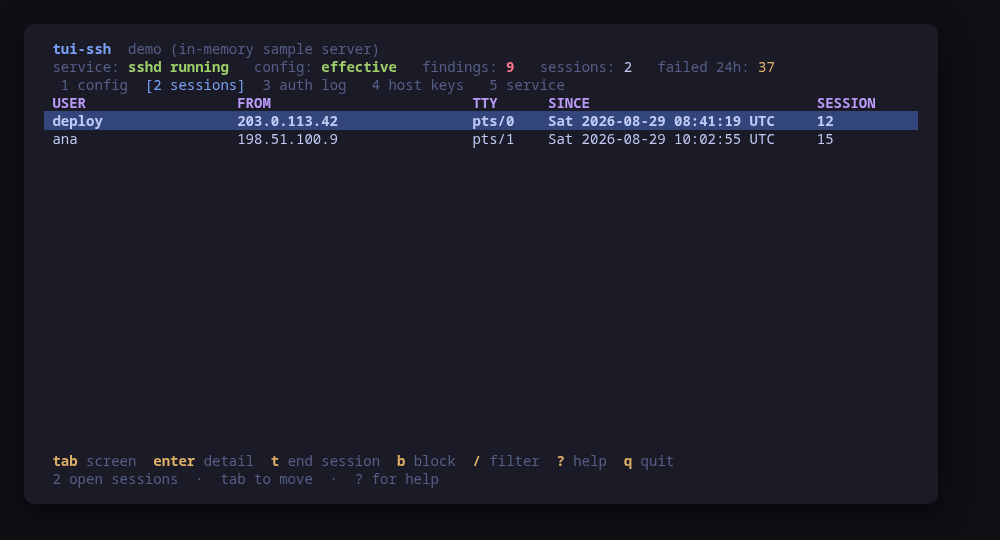
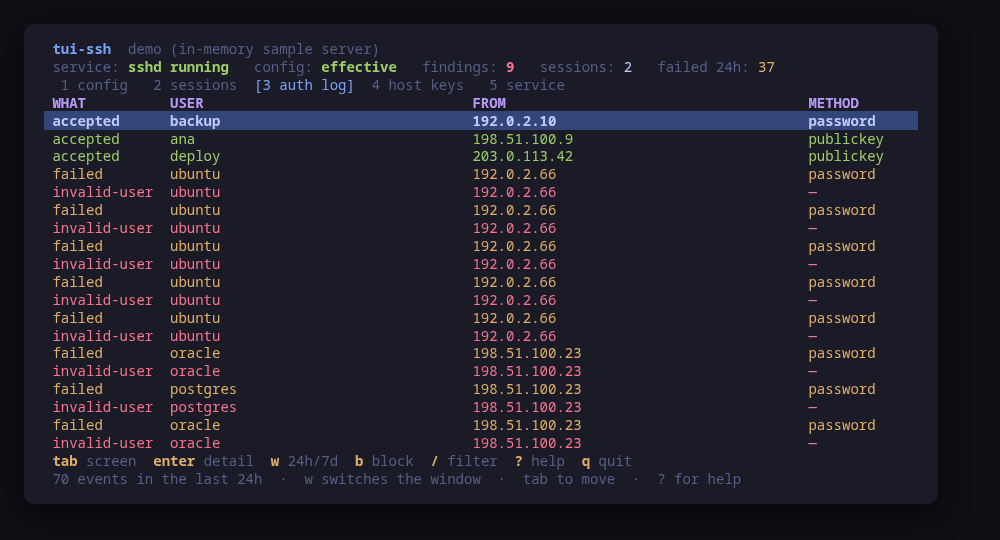
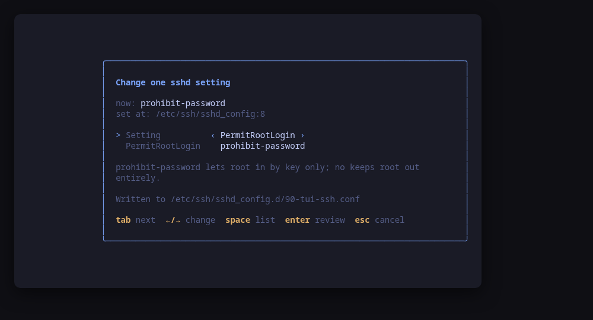
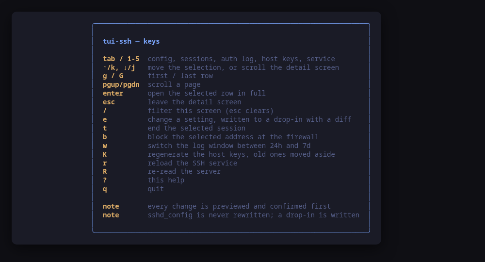

[](https://scorecard.dev/viewer/?uri=github.com/tui-tools/tui-ssh)

> **Beta.** Beta: the family is days old and still changing. Package names,
> flags and keys may move without notice until 1.0. Pin versions, and report
> what breaks.

A terminal UI for the machine's SSH server. It asks `sshd` what its
configuration **actually is**, shows the settings that decide who gets in with a
verdict and the file and line that set each one, and **previews the exact
command line of every change before running it**.

`sshd_config` has no TUI. What you get is a file you cannot read without root, a
`sshd -T` you have to know about, `journalctl | grep`, `ss`, `loginctl` and
`ssh-keygen -lf` — in six different terminals. `tui-ssh` puts them on one
screen, in the [Omarchy](https://omarchy.org) visual style.



> **Status: early, under validation.** An independent tool that follows the
> Omarchy visual style; it is **not** part of the Omarchy project and not
> endorsed by its maintainers. Expect rough edges.

## Install

<!-- install:start -->
<!-- Generated by tui-kit/tools/render-install.py from tool.json. -->
<!-- Edit the manifest, then run `make readme`. -->

### Arch Linux

Needs the tui-tools repository, which is a [one-time
setup](https://tui-tools.github.io/install/).

The one-liner detects the distribution and adds the repository and its signing
key:

```sh
curl -fsSL https://pkgs.tui.tools/install.sh | sh
```

Piping a script into a shell is not this family's style, so here is the same
setup by hand — read it, or read the script first with `curl -fsSL
https://pkgs.tui.tools/install.sh -o install.sh`:

```sh
curl -fsSL -o /tmp/tui-tools.asc https://pkgs.tui.tools/pubkey.asc
sudo pacman-key --add /tmp/tui-tools.asc
sudo pacman-key --lsign-key \
  "$(gpg --show-keys --with-colons /tmp/tui-tools.asc | awk -F: '/^fpr:/{print $10; exit}')"
printf '[tui-tools]\nServer = https://pkgs.tui.tools/arch/$arch\n' \
  | sudo tee -a /etc/pacman.conf
sudo pacman -Sy
```

Then, and for every other tool in the family:

```sh
sudo pacman -S tui-ssh
```

Upgrades then arrive with the rest of your system updates.

### Debian and Ubuntu

Needs the tui-tools repository, which is a [one-time
setup](https://tui-tools.github.io/install/).

The one-liner detects the distribution and adds the repository and its signing
key:

```sh
curl -fsSL https://pkgs.tui.tools/install.sh | sh
```

Piping a script into a shell is not this family's style, so here is the same
setup by hand — read it, or read the script first with `curl -fsSL
https://pkgs.tui.tools/install.sh -o install.sh`:

```sh
sudo install -d -m 0755 /etc/apt/keyrings
curl -fsSL https://pkgs.tui.tools/pubkey.asc \
  | sudo gpg --dearmor -o /etc/apt/keyrings/tui-tools.gpg
echo "deb [signed-by=/etc/apt/keyrings/tui-tools.gpg] https://pkgs.tui.tools/deb stable main" \
  | sudo tee /etc/apt/sources.list.d/tui-tools.list
sudo apt update
```

Then, and for every other tool in the family:

```sh
sudo apt install tui-ssh
```

Upgrades then arrive with the rest of your system updates.

### Fedora and RHEL

Needs the tui-tools repository, which is a [one-time
setup](https://tui-tools.github.io/install/).

The one-liner detects the distribution and adds the repository and its signing
key:

```sh
curl -fsSL https://pkgs.tui.tools/install.sh | sh
```

Piping a script into a shell is not this family's style, so here is the same
setup by hand — read it, or read the script first with `curl -fsSL
https://pkgs.tui.tools/install.sh -o install.sh`:

```sh
sudo rpm --import https://pkgs.tui.tools/pubkey.asc
sudo curl -fsSL -o /etc/yum.repos.d/tui-tools.repo https://pkgs.tui.tools/rpm/tui-tools.repo
sudo dnf makecache
```

Then, and for every other tool in the family:

```sh
sudo dnf install tui-ssh
```

Upgrades then arrive with the rest of your system updates.

### Any distribution, static binary

```sh
curl -fsSL https://github.com/tui-tools/tui-ssh/releases/download/v0.1.2/tui-ssh_0.1.2_linux_amd64.tar.gz | tar -xz tui-ssh
sudo install -m0755 tui-ssh /usr/local/bin/tui-ssh
```

One static binary. Verify it against checksums.txt from the same release.

### From source

```sh
git clone https://github.com/tui-tools/tui-ssh
cd tui-ssh && make build
sudo install -m0755 bin/tui-ssh /usr/local/bin/tui-ssh
```

Needs Go 1.27 or newer.

Not packaged for these yet; the static binary works everywhere in the meantime.

### Arch Linux (AUR) — coming soon

```sh
paru -S tui-ssh-bin
```

The -bin package installs the released static binary.

### openSUSE — coming soon

Needs the tui-tools repository, which is a [one-time
setup](https://tui-tools.github.io/install/).

```sh
sudo zypper install tui-ssh
```

The rpm repository is shared with dnf; zypper support is not tested yet.

### Verify a download

Every release of `tui-ssh` ships a `checksums.txt`. Check an archive against it
before installing:

```sh
sha256sum -c checksums.txt --ignore-missing
```
<!-- install:end -->

One static binary, no daemon, no state of its own. Nothing keeps running after
you quit.

## Try it without root

```sh
tui-ssh --demo
```

`--demo` runs against a sample server: passwords still accepted, root still
allowed in by key, two people logged in, a day of somebody working through a
user list, and three host keys — one of them smaller than it should be. Every
key works, every command is built and previewed for real, and nothing touches
your system.

## What sshd says, not what the file says

The settings screen is `sshd -T`: the server's own answer, with every default
resolved and every `Include` already merged. Reading the files instead would
show you what somebody wrote; this shows you what the server does.

Where a setting *was* written still matters, so that is read too — the whole
include tree, in order — and shown next to the value. The two reads answer
different questions and the screen keeps them apart: the value is sshd's, the
file and line are the tree's.

The security-relevant keywords come first, in a fixed order, because the
question you arrive with is "can root log in with a password" and the answer to
that should not be six screens down between `MaxSessions` and `PermitTTY`. Each
one carries a verdict — `ok`, `!`, `!!` — and one sentence you can argue with.
Everything else in the file follows, unjudged.

Two of those opinions are deliberately quieter than a hardening checklist would
have them. `PermitRootLogin prohibit-password` is `ok`: root by key only is the
default a great many distributions ship and there is no password to guess at, so
only `yes` is a finding. `AllowTcpForwarding yes` carries **no** verdict at all —
it is the OpenSSH default and what nearly every machine runs. It stays on the
list with its consequence spelled out, because a list that flags what everybody
runs teaches you to stop reading the list.

If `sshd -T` cannot run — no `sudo -n`, or a configuration sshd refuses to
parse — the files are read instead and the header says `config: from files`
rather than `effective`. It is a weaker answer and it is labelled as one.

## Every change is previewed, and goes to a drop-in



`tui-ssh` never rewrites `/etc/ssh/sshd_config`. It writes exactly one file,
`/etc/ssh/sshd_config.d/90-tui-ssh.conf`, so a hand-written configuration with
its comments and its `Match` blocks is left alone.

Before you are asked anything, the new file is staged in a private temporary
directory and handed to the server's own parser — `sshd -t -f` — so a value
sshd would refuse is a message on the form rather than a service that fails to
reload after the file is already in `/etc`. The dialog then shows the check, the
unified diff, and the two commands that apply it. `y` runs them, `n` does not.

### The Include-order caveat, read rather than assumed

sshd takes the **first** value it is given for nearly every keyword. So whether
a drop-in wins depends on where the `Include` sits in `sshd_config` and on what
is written above it — and that differs between distributions and between one
machine and the next.

`tui-ssh` does not carry a table of what each distribution does. It parses the
whole include tree in reading order, works out where its own file would be
spliced in, and refuses to pretend:

- If a keyword is already set in a file sshd reads **before** the drop-in, the
  confirm dialog says so by name and line, and tells you to change it there.
- If nothing includes `/etc/ssh/sshd_config.d` at all — an OpenSSH older than
  8.2, or a configuration somebody trimmed — it says the file would not be read
  and names the line to add.

One distribution was checked by hand while this was written: on Fedora 42
(`openssh-server-9.9p1-14.fc42`) the packaged `sshd_config` has
`Include /etc/ssh/sshd_config.d/*.conf` as its first non-comment line, so the
drop-in wins every keyword. The current Debian, Ubuntu and Arch packages are
believed to put it in the same place, but that has not been verified here and
nothing in the tool depends on it — the include order is read from the machine
in front of you on every start, and it is what the warning is computed from.

### Changing the port

Moving `Port` or `ListenAddress` is the one change that can lock you out of a
machine through no fault of sshd's, so it carries a warning of its own: the
firewall has to allow the new one before the reload
([tui-firewall](https://github.com/tui-tools/tui-firewall) is the tool for
that), and keep this session open until you have tested a new one.

## Who is logged in



The sessions screen joins what `loginctl` knows about a login — the account, the
terminal, the session id — to what the kernel knows about the socket under it,
from `ss` filtered to the port sshd is really listening on. `t` ends the
selected session, with a preview and a warning that everything running in it is
killed.

A connection logind knows nothing about — an `sftp` transfer, a forced
command — is still shown, with the account left blank and the reason spelled
out, rather than dropped.

## Who is knocking



The last 24 hours or 7 days from `journalctl -u sshd -u ssh`, falling back to
`/var/log/auth.log` on a machine with rsyslog and no journal. Accepted, failed
and invalid-user counts; the addresses doing the most of it and the accounts
they are trying; and the raw line behind any row, on `enter`.

`b` blocks the selected address — but only when `ufw` is the firewall that is
actually running. On a machine whose rules are `nftables` or `firewalld` a
`ufw deny` writes into a firewall nobody is using, which is worse than doing
nothing because it looks like it worked; there, `b` says so and points at
tui-firewall.

## Host keys

`4` lists `/etc/ssh/ssh_host_*_key.pub` with type, size and SHA256 fingerprint —
the thing a client compares against its `known_hosts` — and judges them: a DSA
key or an RSA key under 2048 bits is a finding.

`K` replaces the whole set. The current keys are **moved aside** into a dated
directory rather than deleted, so a regeneration done by mistake is reversible
with a `mv` you can read, and the dialog says in as many words what it does to
every client that has ever connected.

## Usage

```sh
tui-ssh                        # drive the real server
tui-ssh --demo                 # sample server, no privileges needed
tui-ssh --check                # read the server, print JSON, exit
tui-ssh --theme ~/mytheme/colors.toml
tui-ssh --sudo ""              # run the commands directly (as root)
tui-ssh --version
```

### `--check`, for scripts and tests

`--check` is the non-interactive read path: it loads the server through the same
backend the UI would use, prints what it parsed as JSON and exits 0, or exits 1
with the reason if the backend cannot be read. No UI, and it never builds or
runs a mutation, so it is safe to run anywhere.

```console
$ tui-ssh --check | head -14
{
  "tool": "tui-ssh",
  "version": "0.1.0",
  "backend": "openssh",
  "describe": "sshd via /usr/bin/sudo -n",
  "effective": true,
  "verdicts": [
    {
      "key": "PermitRootLogin",
      "value": "prohibit-password",
      "verdict": "ok",
      "source": "/etc/ssh/sshd_config:8",
      "note": "root by key only; no password can be guessed into the account."
    },
```

It exists so a test can assert on what the tool *parsed* rather than on what it
painted — that the unit name matches what systemd calls it, that
`PermitRootLogin` matches `sshd -T`, and, on a machine where neither read is
permitted, that the tool said so instead of showing an empty screen.

[tui-lab](https://github.com/tui-tools/tui-lab) uses it to test this tool
against real machines on Ubuntu, Fedora and Arch; the assertions live in
[`test/smoke.sh`](test/smoke.sh), and every one of them is read-only.

## What it can do to your machine

Every one of these is previewed and confirmed first.

| Key | What runs |
| --- | --- |
| `e` | `sshd -t -f <staged file>` (a read, before the question), then `install -m 600 <staged file> /etc/ssh/sshd_config.d/90-tui-ssh.conf` and `systemctl reload <unit>` |
| `t` | `loginctl terminate-session <id>` |
| `b` | `ufw deny from <address>`, and only when ufw is the active firewall |
| `K` | `install -d -m 700 /etc/ssh/tui-ssh-hostkeys-<stamp>`, `mv -- <the key files> <that directory>/`, `ssh-keygen -A`, `systemctl reload <unit>` |
| `r` | `systemctl reload <unit>` |

Nothing else. There is no code path that writes to `/etc` other than that one
`install`, its destination is a constant rather than a parameter, and the only
`mv` refuses any path that is not `/etc/ssh/ssh_host_*_key`.

The unit is `sshd` on Fedora, Arch and openSUSE and `ssh` on Debian and Ubuntu.
It is read from systemd, not assumed.

## Keys

| Key | Action |
| --- | --- |
| `tab` / `1`–`5` | Move between config, sessions, auth log, host keys and service |
| `↑`/`k`, `↓`/`j` | Move the selection, or scroll the detail screen |
| `g` / `G` | First / last row |
| `pgup` / `pgdn` | Scroll a page |
| `enter` | Open the selected row in full |
| `esc` | Leave the detail screen |
| `/` | Filter this screen (`esc` clears) |
| `e` | Change a setting, written to the drop-in with a diff to confirm |
| `t` | End the selected session |
| `b` | Block the selected address at the firewall |
| `w` | Switch the log window between 24 hours and 7 days |
| `K` | Regenerate the host keys, old ones moved aside |
| `r` | Reload the SSH service |
| `R` | Re-read the server |
| `?` | Help |
| `q` | Quit |

In the **setting editor**: `tab` moves between the two fields, `←`/`→` cycles a
value, `space` opens the list, `enter` builds the change and shows it, `esc`
cancels.





## What v0.1 can do

- Read the effective configuration from `sshd -T`, falling back to parsing
  `/etc/ssh/sshd_config` and its `Include` tree when that is not permitted, and
  say which of the two is on screen.
- Judge the settings that decide who gets in — `PermitRootLogin`,
  `PasswordAuthentication`, `PubkeyAuthentication`,
  `KbdInteractiveAuthentication`, `PermitEmptyPasswords`, `MaxAuthTries`,
  `LoginGraceTime`, `Port`, `ListenAddress`, `AllowUsers`, `AllowGroups`,
  `UsePAM`, `X11Forwarding`, `AllowTcpForwarding`, `ClientAliveInterval` — and
  flag a weak entry in `Ciphers`, `KexAlgorithms` or `MACs` by name.
- Show which file and line set each value, which one wins under sshd's
  first-value rule, and which are only set inside a `Match` block.
- Change one keyword through a guided form, written to
  `/etc/ssh/sshd_config.d/90-tui-ssh.conf`, checked by `sshd -t -f` before you
  are asked, reviewed as a unified diff, installed with `install -m 600` and
  applied with `systemctl reload`.
- List the live logins with the address, terminal and session behind each, and
  end one.
- Summarise the authentication log over a day or a week, with the busiest
  addresses and the accounts being tried, and block an address through `ufw`
  when `ufw` is what is running.
- Fingerprint the host keys and replace the whole set, old keys moved aside.
- Report the unit, its listening sockets and whether `fail2ban` or `sshguard`
  is installed.
- Follow the active Omarchy theme, and respect `NO_COLOR`.

## What v0.1 cannot do

- **It does not edit `sshd_config`.** One drop-in, one keyword at a time, from a
  closed set. Everything else is a job for `$EDITOR` — and the file view tells
  you which file and which line to open.
- **No `Match` block editing.** Blocks are parsed and shown, and a keyword set
  only inside one is labelled as such, but the form writes at file scope.
- **No authorized_keys.** Whose key is on which account is
  [tui-users](https://github.com/tui-tools/tui-users)' question, not this one's.
- **No `ssh_config`**: this is the server, not the client.
- **No fail2ban or sshguard rules.** Their presence is reported, read-only;
  their jails belong to whatever owns them.
- **No certificate authority**, no `ssh-keygen -s`, no principals.
- The `sshd -t -f` check covers the staged drop-in on its own, not the merged
  configuration: it proves sshd accepts these keywords and these values, and
  the include-order check is what covers the rest.

## Compatibility

<!-- compat:start -->
<!-- Generated by tui-kit/tools/render-compat.py from tool.json. -->
<!-- Edit the manifest, then run `make readme`. -->

`tui-ssh` probes its backend once at startup and shows the version in the
header. A version nobody has tested is marked `(untested)` there rather than
hidden; one below the minimum is marked as such and the tool still runs.

### openssh

| | |
| --- | --- |
| Binary | `ssh` |
| Version read with | `ssh -V` |
| Minimum | 8.2 |
| Tested | `9.6`, `10.2`, `10.5` |
| Version-gated features | `include-dropins` (since 8.2), `kbd-interactive` (since 8.7) |

| Versions | What changes |
| --- | --- |
| `>=10.5` | `sshd -T` prints the canonical spelling of every keyword (`PermitRootLogin no`) where 10.2 and earlier lower-case it (`permitrootlogin no`); both forms are parsed to the canonical name, so the verdicts and the source lines are the same either way |
| `>=8.2` | the version comes from `ssh -V`, which prints to standard error; `sshd -V` only exists from OpenSSH 9.6, so asking the server itself would report nothing over most of the supported range |
| `<8.2` | `Include` does not exist, so /etc/ssh/sshd_config.d is never read; tui-ssh will not rewrite sshd_config itself, so the editor has nowhere to write and says so |
| `<8.7` | `KbdInteractiveAuthentication` is still spelled `ChallengeResponseAuthentication`; both are read, and the old name is what gets written |

The tested versions are generated from `compat/results.jsonl`, which the tool's
own smoke test appends to when it runs against a real machine in
[tui-lab](https://github.com/tui-tools/tui-lab).
<!-- compat:end -->

## Configuration

`/etc/tui-ssh/config.toml`, then `~/.config/tui-ssh/config.toml` (the user file
overrides the machine-wide one), then `TUI_SSH_*` in the environment. Flags
override everything. See [`examples/config.toml`](examples/config.toml).

```toml
# Privilege escalation prefix; "" runs the command directly.
sudo = "sudo -n"

# Path to an Omarchy-style colors.toml; empty follows the active theme.
theme = ""
```

## Theme

The default palette is **Tokyo Night**. On Omarchy, the tool reads the active
desktop theme from `~/.config/omarchy/current/theme/colors.toml` and follows it.
`TUI_THEME` or `--theme` override; `NO_COLOR` drops color and keeps layout. The
rules live in [tui-kit](https://github.com/tui-tools/tui-kit#theme-rules).

## Architecture

The UI never builds an `sshd`, `systemctl`, `loginctl` or `ss` command line. It
talks to `internal/ssh.Backend`, which returns a server-neutral model:

```
Model{Effective, EffectiveReason, Settings, Files, Service, Sessions, Auth,
      HostKeys, Firewall}
Setting{Key, Value, Effective, Security, Verdict, Note, Sources, Default}
Source{File, Line, Text, Match}
```

`internal/openssh` is the only package that starts a process. It drives eight
programs through eight kit runners — `sshd`, `systemctl`, `ss`, `loginctl`,
`journalctl`, `ssh-keygen`, `install` and `mv`, plus `ufw` for the one rule and
`cat` for the escalated read — and
[`check-exec.sh`](https://github.com/tui-tools/tui-kit/blob/main/tools/check-exec.sh)
fails the build if any other package imports `os/exec`.

Mutations are `runner.Command` values produced by the backend. The UI shows them
and, on confirmation, hands the same ones back to the
[kit runner](https://github.com/tui-tools/tui-kit#the-contract-preview-confirm-run),
which resolves the binary and the privilege prefix. That is the whole trust
boundary, and it is why the preview is guaranteed to match what executes.

## Development

```sh
make check        # gofmt, go vet, the exec boundary and the tests: what CI runs
make test
make build
make demo
make screenshots  # re-render the frames above from --demo
```

The parser tests run against captured output in `internal/openssh/testdata`.
Where a real capture was possible it is a real one — `ssh -V`, `loginctl`,
`systemctl show`, `ss -tlnp` and `ssh-keygen -lf` all answer to any user, so
those files are what a Fedora 42 host printed, with the account name and one
routable network rewritten into the documentation ranges. Two are synthetic and
say so: `sshd -T` needs root, and `sshd_config` is mode 0600 on that host, so
those fixtures are written from `sshd_config(5)` — one with its `Include` first
and one with it last, which is the difference the whole editor turns on.

Every parser in `internal/openssh` also carries a Go native fuzz target seeded
from those fixtures. `go test` replays the seeds on every commit; exploring past
them is a thing you run, one target at a time:

```sh
go test -run=^$ -fuzz=FuzzParseAuthLog -fuzztime=5m ./internal/openssh/
```

A crash writes its input under `internal/openssh/testdata/fuzz/`, and that file
is committed so the bug cannot come back quietly.

Dependencies are deliberately small: Bubble Tea, Bubbles and
[tui-kit](https://github.com/tui-tools/tui-kit), which carries the palette, the
widgets, the config loader and the command runner shared by the whole family.

## Safety notes

- **Keep a second session open.** Changing `Port`, `ListenAddress`,
  `AllowUsers`, `AllowGroups` or `PubkeyAuthentication` and reloading can end
  your ability to log in again. The dialog warns for each of them; the second
  terminal is what makes the warning survivable.
- The drop-in is staged in a private temporary directory and parsed by sshd
  *before* you are asked, and the only privileged step that **changes** anything
  is the `install` you approved.
- Ending a session kills everything running in it. Replacing the host keys makes
  every client that has connected before refuse to connect until its
  `known_hosts` entry is removed. Both say so before you agree.
- Two reads escalate, unprompted, through `sudo -n`: `sshd -T`, and `cat` for a
  configuration file the plain read cannot open. Fedora and Arch ship
  `/etc/ssh/sshd_config` mode 0600, so without the second one those machines
  would show every setting as coming from nowhere. Both fall back rather than
  demanding a password, and the screen says which answer you are looking at.
- `tui-ssh` re-reads the server after every change, so what you see is what the
  system reports, not what the tool assumed.

## Contributing

Contributions arrive as pull requests: the flow, and the bar a change has to
clear, are in the family's
[CONTRIBUTING.md](https://github.com/tui-tools/tui-kit/blob/main/CONTRIBUTING.md).
A vulnerability is reported privately instead, the way
[SECURITY.md](https://github.com/tui-tools/tui-kit/blob/main/SECURITY.md)
describes, and never in a public issue.

## License

MIT — see [LICENSE](LICENSE). Part of the
[tui-tools](https://github.com/tui-tools) family.
